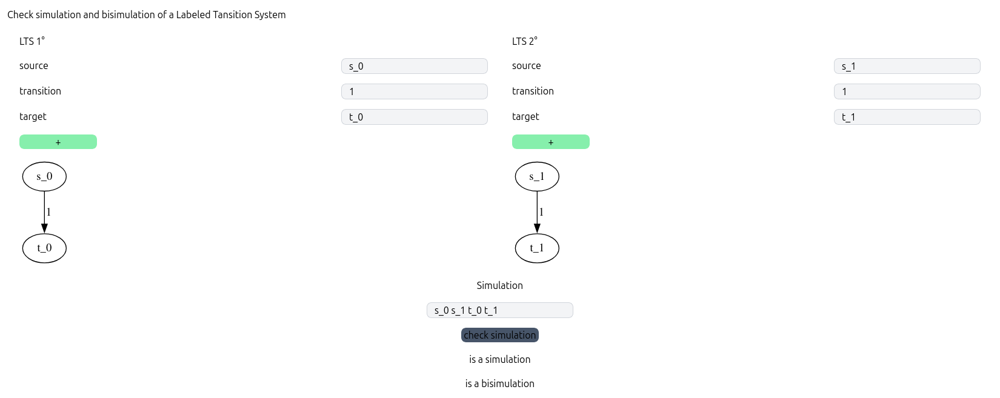

# LTS simulation an bisimulation checker

[See the deployed site here](https://santimc.github.io/lts-sim-check/)

## Run locally

```sh
pnpm dev
```

## How it works

Firt sumbit the two LTS.

After you should summit the simulation as just a list of the states relations, separated by just spaces.

For example if the simulation you want to repesent is:

`R = {(s_0, s_1), (t_0), (t_1)}`

it should be represented as `s_0 s_1 t_0 t_1`



## 🚀 Project Structure

Inside of your Astro project, you'll see the following folders and files:

```text
/
├── public/
├── src/
│   └── pages/
│       └── index.astro
└── package.json
```

Astro looks for `.astro` or `.md` files in the `src/pages/` directory. Each page is exposed as a route based on its file name.

There's nothing special about `src/components/`, but that's where we like to put any Astro/React/Vue/Svelte/Preact components.

Any static assets, like images, can be placed in the `public/` directory.
